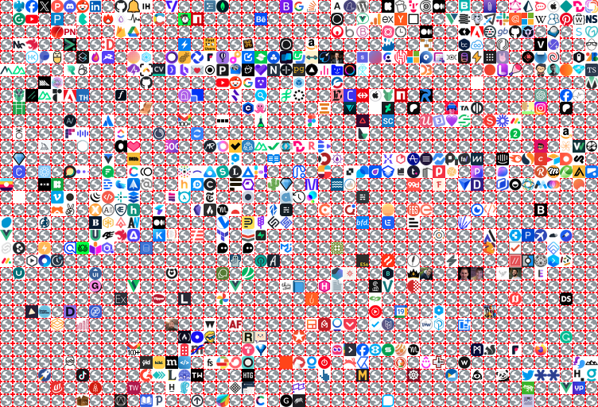

# Favicon with 404

This sample demonstrates a way to detect non-cached favicons.

## Overview

The approach is to compare the `data://` URL of a loaded icon image to the `data://` URL of a known missing icon image.

The helper code does this by passing a reference to a function and reporting the result on load:

```js
// create the helper
const tester = makeIconTester()

// initialize with missing icon
await tester.init()

// load image
const image = document.createElement('img')
img.src = tester.getIconUrl('google.com')

// wait for load
const missing = await tester.testIcon(image)
if (missing) {
  // ...
}
```

The demo uses the user's own bookmarks to do this. I've recently transferred machines, so I have 1000s of uncached bookmarks (you may need to import some bookmarks from another computer to test if you don't have any uncached).

Missing icons are outlined in red (just to prove that they can be detected):



You can then:

- `Click` the icon to open a tab, grab the favicon url, and update the icon
- `Ctrl/Cmd+Click` the icon to open a tab, just to check if the page has loaded.

## Performance

The approach is certainly slower than the initial load of cached bookmarks, however it seems to be fast-enough that on a screen of perhaps 50 or so bookmarks it would not be noticeable on initial paint.

In the screenshot above my (admittedly, blazing-fast M3) it takes about 1.5 seconds to process all the nearly 2000 individual domains in nearly 7000 bookmarks:

```
counted 6978 bookmarks
processed 1958 icons in 1429ms
  - missing: 1273
  - added: 685
```

This is **way more** than would be comfortably displayed on screen at once, in any such bookmarking tool.

## Loading missing icons

The tough bit of this problem is, what to do about the missing icons?

The demo lets you click an icon to attempt to load the tab and grab it from the `Tab::onUpdated` event. This is pretty intrusive, so alternative methods would be welcome, perhaps:

- do it in a minimised window
- make an `http` call
- use an offscreen document (I know it [supports scraping](https://stackoverflow.com/a/76268724), but not sure if favicons are loaded automatically)

Perhaps missing icon URLs could be loaded and cached in an internal registry, then removed when pages are loaded in future (though this would require the `tabs` permission).

Anyway, just ideas.

## Running this extension

1. Clone this repository.
2. Load this directory in Chrome as an [unpacked extension](https://developer.chrome.com/docs/extensions/mv3/getstarted/development-basics/#load-unpacked).
3. Pin the extension to the taskbar to access the action button.
4. Open the extension popup by clicking the action button.

## Notes

See original Google Groups [discussion](https://groups.google.com/a/chromium.org/g/chromium-extensions/c/5FYfba0D9ck/m/BGH0hZRAAQAJ).
